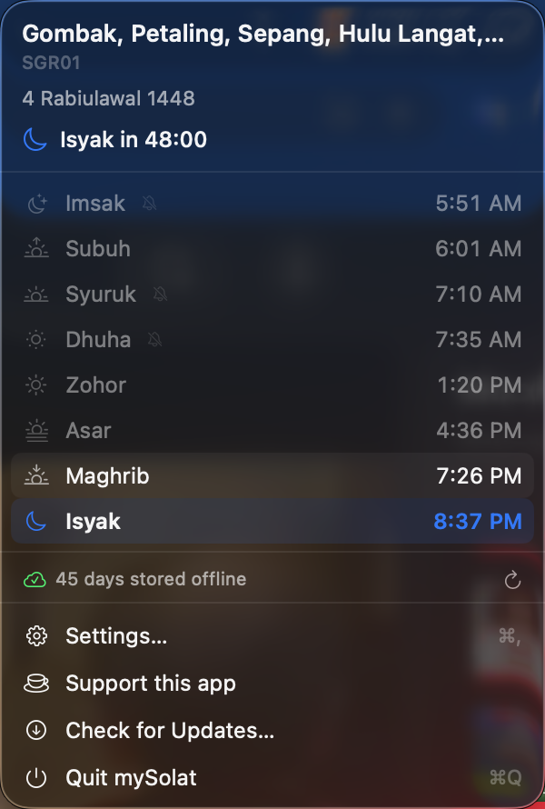
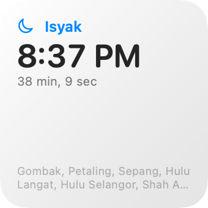
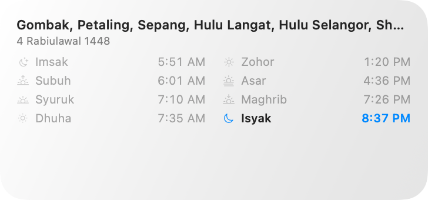
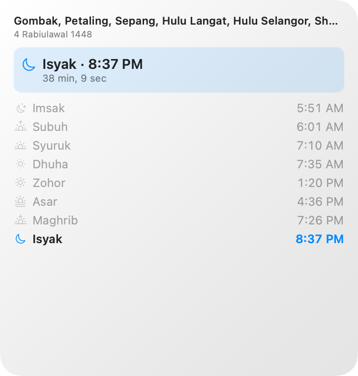
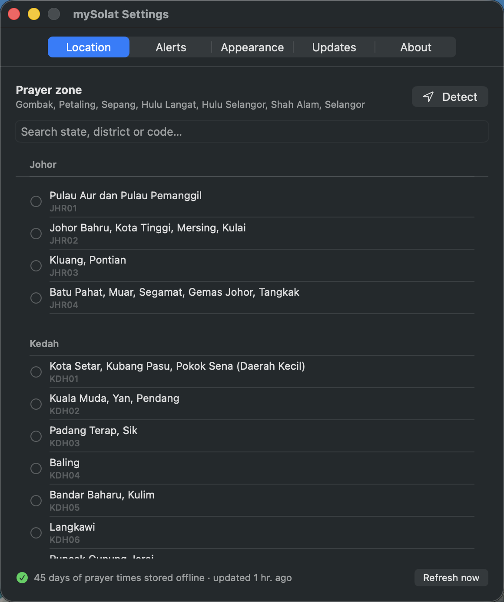
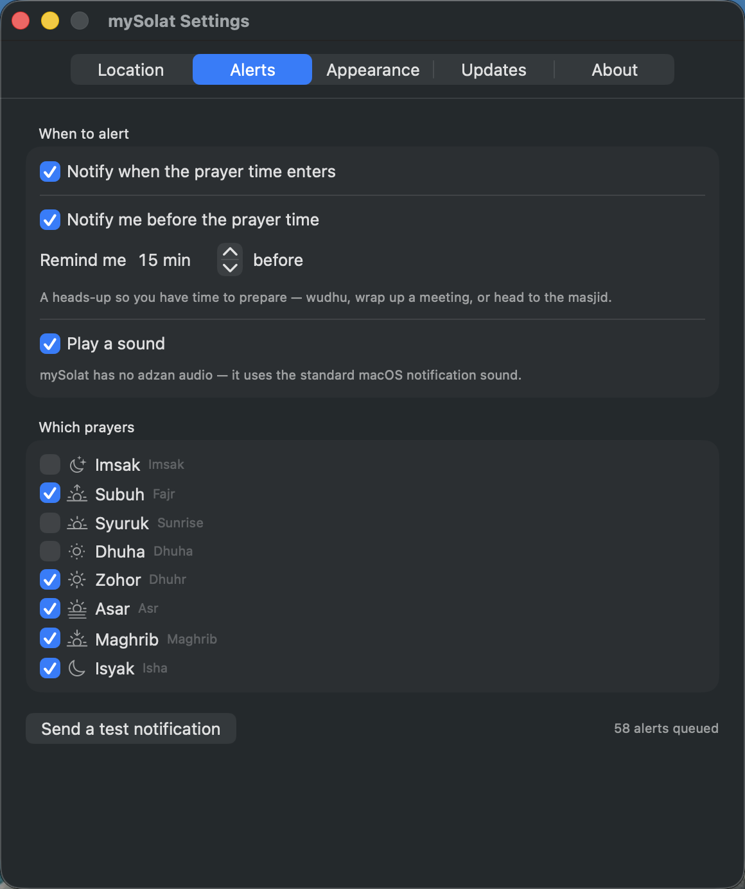
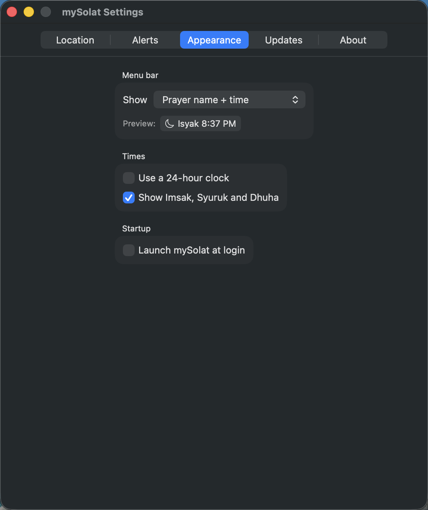
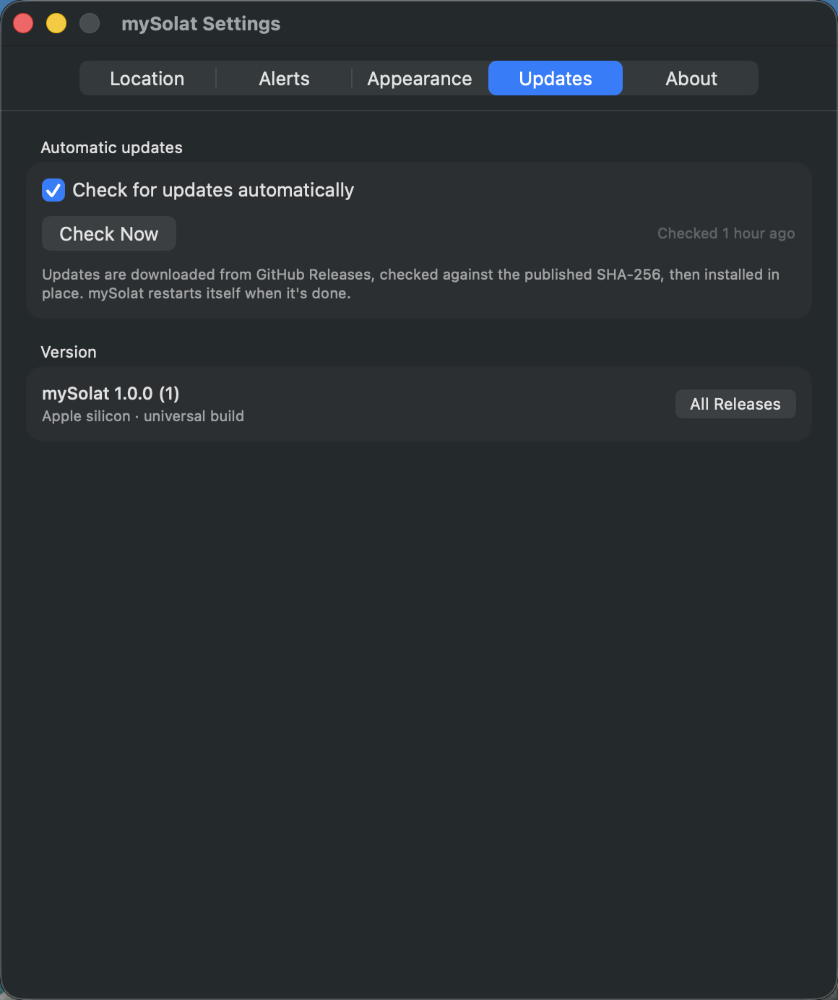
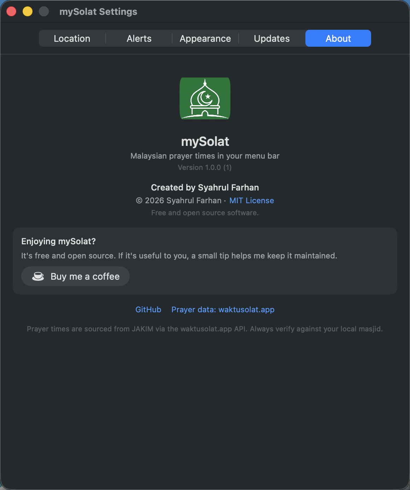

<div align="center">


# mySolat

**Malaysian prayer times in your macOS menu bar.**

Waktu solat JAKIM — always visible, works offline, and reminds you before each prayer.


[](https://github.com/syahrul84/mySolat/actions/workflows/ci.yml)
[](https://github.com/syahrul84/mySolat/releases/latest)
[](LICENSE)
[](https://github.com/syahrul84/mySolat/releases/latest)

</div>

---

## A quick look

<table>
<tr>
<td width="42%" valign="top">



</td>
<td valign="top">

**Click the menu bar item** for the whole day at a glance.

- Live countdown to the next prayer
- The current period highlighted, past times dimmed
- Hijri date for the day
- A bell-slash marks any prayer you've muted
- How many days are stored offline, with a refresh button

The menu bar itself can show the prayer name and time, a countdown, or just the icon.

</td>
</tr>
</table>

### Widgets

Small, medium and large — for the desktop and Notification Center.

<p>

&nbsp;

</p>



## What it does

- **Menu bar countdown** — the next prayer and when it enters, always in view. Five display styles.
- **Notification when the time enters** — mySolat has no adzan audio, so it uses a native macOS notification.
- **A heads-up before each prayer** — anywhere from 1 to 120 minutes, so you have time for wudhu or to head to the masjid.
- **Works offline** — at least 30 days of prayer times are stored locally (usually ~45). Fly, commute, lose your Wi-Fi; the times are still there.
- **All 60 JAKIM zones** — pick your district, or let mySolat detect it from your location.
- **Updates itself** — checks GitHub Releases, verifies the download, installs in place, restarts.
- **Universal** — one build runs natively on Apple silicon and Intel.

## Install

Download the latest `.dmg` from **[Releases](https://github.com/syahrul84/mySolat/releases/latest)**, drag mySolat into Applications, then **right-click it and choose Open**.

> macOS asks for that right-click the first time because the app isn't notarized by Apple — notarization needs a paid Apple Developer account. Every launch after the first is normal, and auto-updates install without prompting.

mySolat has **no Dock icon** — look for the crescent in your menu bar.

**Requirements:** macOS 13 Ventura or later, Apple silicon or Intel.

## Setting it up

<table>
<tr>
<td width="50%" valign="top">

</td>
<td valign="top">

### Location

Search your state, district or JAKIM code — or press **Detect** to find the nearest zone from your location. Your coordinates are used for that one lookup and never stored.

mySolat downloads about 45 days of times straight away, and the footer tells you how much is cached.

</td>
</tr>
<tr>
<td valign="top">

</td>
<td valign="top">

### Alerts

Two independent alerts: one **when the prayer time enters**, and one a configurable number of **minutes before** it, so you can prepare.

Toggle each prayer individually. The five obligatory prayers are on by default; Imsak, Syuruk and Dhuha are off.

</td>
</tr>
<tr>
<td valign="top">

</td>
<td valign="top">

### Appearance

Choose what the menu bar shows, with a live preview. Switch to a 24-hour clock, hide the informational markers, and turn on **Launch at login**.

</td>
</tr>
<tr>
<td valign="top">

</td>
<td valign="top">

### Updates

mySolat checks GitHub Releases daily, verifies the download against the published SHA-256, installs it in place and restarts itself. You can also check on demand.

</td>
</tr>
<tr>
<td valign="top">

</td>
<td valign="top">

### About

Version, licence and credits — plus the tip jar, if mySolat has earned one.

</td>
</tr>
</table>

### Adding the widget

Right-click the desktop → **Edit Widgets**, search **mySolat**, then drag the size you want. The widget follows the zone and clock format set in the app.

## How it works

| Concern | Approach |
|---|---|
| **Data source** | [waktusolat.app](https://waktusolat.app), which serves JAKIM times. `GET /v2/solat/{zone}` returns a calendar month of UNIX timestamps. |
| **30-day guarantee** | The API is month-granular, so mySolat fetches enough whole months to cover today + 35 days — two normally, three near a month boundary. Cached as JSON and reused until coverage drops below 30 days. |
| **Timezone** | Days are bucketed in `Asia/Kuala_Lumpur`, never the system timezone. A Mac set to another region still shows the correct Malaysian day, and says so in the popover. |
| **Notification limit** | macOS allows 64 *pending* notifications per app. With 5 prayers × 2 alert kinds that's 10 a day, so mySolat schedules a rolling window (~58 requests) and re-arms it hourly, on wake, and whenever settings change. The cached prayer data is unaffected. |
| **App ↔ widget** | A macOS widget extension is sandboxed, so the two share an App Group container. If that's unavailable the widget falls back to fetching its own month, so it never renders an empty box. |
| **Auto-update** | Reads the GitHub Releases API, downloads the universal `.zip`, verifies SHA-256 against the release's `checksums.txt` (and an Ed25519 signature when configured), checks the new bundle's identifier and version, then hands the swap to a script that waits for the app to exit before replacing it and relaunching. |
| **Sandboxing** | The widget is sandboxed. The main app is not — it replaces its own bundle when updating and registers a login item, both of which the sandbox forbids. |

## Building from source

**Xcode is not required.** The Command Line Tools are enough — there's no `.xcodeproj` and no SwiftPM manifest, just `swiftc` driven by a `Makefile`.

```bash
git clone https://github.com/syahrul84/mySolat.git
cd mySolat
make run
```

| Command | What it does |
|---|---|
| `make` | Universal (arm64 + x86_64) `build/mySolat.app` |
| `make native` | Host architecture only — faster while iterating |
| `make run` | Build, install to `~/Applications`, relaunch |
| `make test` | Run the test suite |
| `make check` | Type-check the app and widget targets |
| `make release` | `.zip` + `.dmg` + `checksums.txt` in `dist/` |
| `make screenshots` | Regenerate the widget images in this README |
| `make clean` | Remove `build/` and `dist/` |

Stamp a version onto the bundle:

```bash
make release VERSION=1.0.1 BUILD_NUMBER=7
```

`make test` hits the live API. To skip that:

```bash
SOLAT_SKIP_NETWORK=1 make test
```

### Layout

```
Sources/Shared/    models, API client, cache, preferences — compiled into both targets
Sources/App/       menu bar app, settings, notifications, updater
Sources/Widget/    WidgetKit extension
Resources/         Info.plists, entitlements, logo, bundled zone list
Tests/             assertion harness (no XCTest — that needs Xcode)
scripts/           icon, DMG, widget rendering, update-signing helpers
docs/screenshots/  the images in this README
```

The shared sources are compiled into both the app and the widget rather than linked as a library, which keeps the build to two plain `swiftc` invocations per architecture.

The widget images above are generated by `make screenshots`, which renders the real widget views against the real cached times — so they can't drift from the code.

## Cutting a release

```bash
git tag v1.0.1
git push origin v1.0.1
```

The [release workflow](.github/workflows/release.yml) builds the universal app, runs the tests, verifies the archive it just produced (checksum, signature, bundle version, both architectures), and publishes the Release. Installed copies pick it up within a day, or immediately via **Settings › Updates › Check Now**.

### Optional: sign your updates

Verification against `checksums.txt` is always on. Adding a signing key means an attacker who could serve both a modified archive *and* a matching checksum still couldn't produce a valid signature.

```bash
make updater-keys
```

Paste the **public** key into `UpdatePublicKey` in `Resources/App-Info.plist`, and add the **private** key as a repository secret named `UPDATE_SIGNING_KEY`. Never commit the private key — and keep a copy in a password manager, because losing it means installed copies can no longer verify signed updates.

## Support

mySolat is free and open source. If it's useful to you:

<a href="https://ko-fi.com/syahrul84"></a>

## Accuracy

Prayer times come from JAKIM via waktusolat.app and are presented unmodified — mySolat applies no calculation of its own. Always defer to your local masjid.

## License

[MIT](LICENSE) © 2026 Syahrul Farhan. Prayer time data belongs to JAKIM and is not covered by this license.
